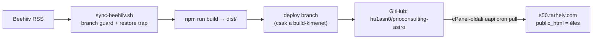

# prioconsulting-astro — rendszerterv

**Frissítve:** 2026-08-10 · Ez a projekt kurált jelen-állapot oldala. A session-napló a repo CLAUDE.md-jében él, a task-szintű teendők a backlogban. Ahol számot állítunk, jelöljük: **[mért]** vagy **[terv]**.

---

## 1. Miért létezik?

A prioconsulting.hu a **Prio Consulting Kft. elsődleges sales-site-ja** — Simon András „Applied AI IT PM @ Prio Consulting" pozicionálásának ügyfél-oldali felülete. A 2026-04-25-i brand-merger óta a Kft. az **egyetlen jogi entitás** (az e.v. szüneteltetve), és a site két specialty layerrel él: **Core (60% — SAP IS-U / energetika)** + **Applied AI réteg (40% — a `/applied-ai/` pillar oldal köré építve)**. A WordPress helyett statikus Astro: gyors, olcsó, git-verziózott, cron-ból újraépíthető.

## 2. Mit tud?

- **Kétnyelvű statikus site** (HU + gyökér, EN az `/en/` alatt): 18 `.astro` oldalforrás **[mért]** — index, szolgáltatások, rólam/about, kapcsolat, blog, adatvédelem, impresszum, applied-ai mindkét nyelven
- **`/applied-ai/` pillar oldal** HU (2067 szó **[mért]**, Service + FAQPage JSON-LD) és `/en/applied-ai/` (4 JSON-LD blokk, `inLanguage: en`, kétirányú hreflang); az Applied AI a főmenüben mindkét nyelven
- **SEO Fázis 1 baseline**: NAP (1077 Budapest), telefonszám, JSON-LD: Organization + ProfessionalService + Person + FAQPage + Service[]
- **Beehiiv-blogszinkron**: a hírlevél-tartalom RSS-ből épül a blogba, cron-vezérelt rebuilddel
- **Email-obfuszkáció**: `info[ at]prioconsulting.hu`, 0 `mailto` a kimenetben
- **Tartalmi hitelesség**: a halucinált MOL-testimonial („K. Péter") és az OTP/Richter-hivatkozások eltávolítva; élesben `curl`-lel verifikálva 2026-07-30 (0 találat mindhárom oldalon) **[mért]**

## 3. Architektúra és jelenlegi állapot

Statikus Astro-projekt a home-szerveren (M920q), a kimenet egy **deploy branch**-en utazik a tárhelyre; a tárhely maga pullol (ADR-002).

**Állapot-tábla:**

| Komponens | Állapot |
| --- | --- |
| Site élesben (prioconsulting.hu) | ✅ éles; `/applied-ai/` HTTP 200, 2129 szó **[mért, 2026-07-30]** |
| Deploy-lánc (3 hónapos fagyás után) | ✅ helyreállítva 2026-07-28 (ADR-002) |
| `sync-beehiiv.sh` hardening (guard + trap + `.env`/log-védelem) | ✅ kész |
| SEO Fázis 1 (NAP + JSON-LD) | ✅ kész |
| `/en/applied-ai/` + főmenü mindkét nyelven | ✅ éles (merge `dfc34f2`) |
| Új 12 hetes go-to-market ciklus | ⏳ **[NYITOTT — user-döntés]** |

## 4. Döntések

| Döntés | Lényeg |
| --- | --- |
| **ADR-002** (2026-07-28, `~/.claude/decisions/`) | A deploy-transzport a **tárhely oldaláról** indul: cPanel-oldali cron (`uapi VersionControl update`, napi 0:00 + 12:00) — a szerverről hívott UAPI-t az Imunify360 elutasítja. A szerveroldali hívás best-effort kiegészítés marad `CPANEL_TOKEN`-guard mögött. Élesedés ütemezett, nem azonnali (max. 12 óra csúszás); éles verifikáció (`curl -sI` + tartalmi grep) minden deploy után kötelező — a git állapot nem bizonyíték |
| **Brand-merger** (2026-04-25) | Prio Consulting Kft. az egyetlen jogi entitás; unified „Applied AI IT PM @ Prio Consulting" pozicionálás; Core 60% (SAP IS-U/energetika) + Applied AI 40% réteg |
| **Tartalmi hitelesség** | Kliensnév/testimonial csak CV-ből vagy explicit user-megerősítésből — a 2026-04-22-i halucinált testimonial-eset óta szabály |

## 5. Interfészek

- **Beehiiv RSS → blog**: a `sync-beehiiv.sh` a hírlevél-feedből építi újra a blogoldalakat; a cPanel-hitelesítő adatok a git-ignored `.env`-ben (a takarító `find` explicit kivételezi — egy korábbi futás mid-deploy törölte, ami némán leszedte a pull-triggert)
- **cPanel (s50.tarhely.com)**: a `public_html` közvetlenül a repo deploy branchének klónja; a pull a tárhely-oldali cron dolga. Csapda: untracked fájl a `public_html`-ben (pl. `robots.txt`) megállítja a pullt (ADR-002). Külön szerver és külön cPanel-fiók, mint a simonprojects.eu (s40)
- **simonprojects.eu sister-site**: technical proof / credibility engine — minden CTA-ja ide, a `prioconsulting.hu/applied-ai/`-ra mutat; a prioconsulting.hu az elsődleges brand és impresszum-forrás

## 6. Üzemeltetés

- **Deploy-lánc**: `sync-beehiiv.sh` → Astro build → `dist/` mentés `/tmp`-be → deploy branch (csak build-kimenet, forrás soha) → push → **cPanel-oldali uapi cron pullol**. Ütemezés: a gyökér `~/CLAUDE.md` **Cron-táblája** az egyetlen forrás — itt nem ismételjük
- **Önvédelem a scriptben**: branch guard (ha a working tree deploy-on ragadt, self-heal vagy hangos hiba), EXIT restore trap (build-bukás/OOM után is visszaáll main-re), staged-diff alapú commit-döntés, `.env` + `*.log` kivételezés a takarításban, `node_modules` visszaállítás branch-váltás után
- **Monitorozás**: Netdata StatsD gauge-ok (`cron_exit.beehiiv_sync_prio`, `cron_time.beehiiv_sync_prio`); napló a `beehiiv-sync.log`-ban
- **Kézi deploy sürgős esetben**: push után cPanel „Update from Remote" — vagy megvárni a következő tárhely-oldali pullt
- **Éles verifikáció**: minden tartalmi deploy után `curl` az érintett oldalakra (last-modified + tartalmi grep)

## 7. Roadmap

1. **Új 12 hetes Applied AI go-to-market ciklus** — a portal `/applied-ai-plan` terve 2026-07-13-án lejárt, és 5 nappal a brand-merger *előtt* készült; új dátumok/célszám/LinkedIn-kadencia **[NYITOTT — user-döntés]**
2. **Applied AI réteg bővítése** — a hub-and-spoke linkstruktúra további spoke-oldalai a `/applied-ai/` pillar alá **[terv]**
3. **Deploy-csúszás csökkentése, ha zavaróvá válik** — FTP-alapú GitHub Action a utility-sites mintájára, az Imunify360 megkerülésével (ADR-002 alternatíva) **[terv]**

---

*Kapcsolódó: ADR-002 (`~/.claude/decisions/ADR-002-cpanel-deploy-transport.md`) · gyökér `~/CLAUDE.md` → Státusz/prioconsulting-astro + Cron-tábla · portal `/applied-ai-plan` (lejárt ablakú roadmap)*
